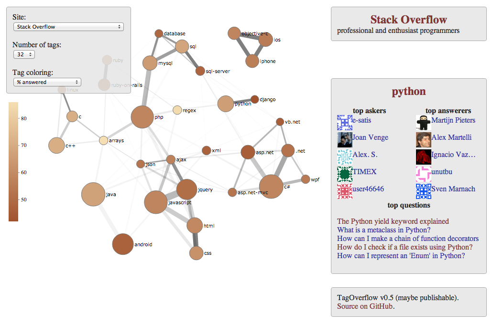

TagOverflow
===========

An interactive map of StackExchange tags.
See it [here](http://stared.github.io/tagoverflow/).

(A very early version. In the meantime, take a look at my older project, a non-interactive version: [Tag Graph Map of StachExchange](https://github.com/stared/tag-graph-map-of-stackexchange/wiki).)

As of now it looks more or less like:

